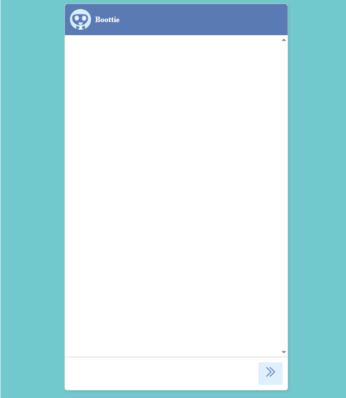
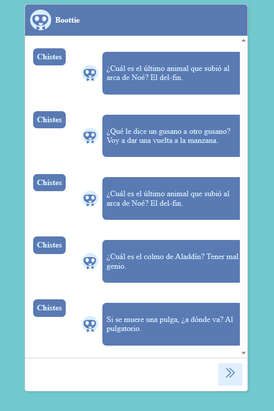
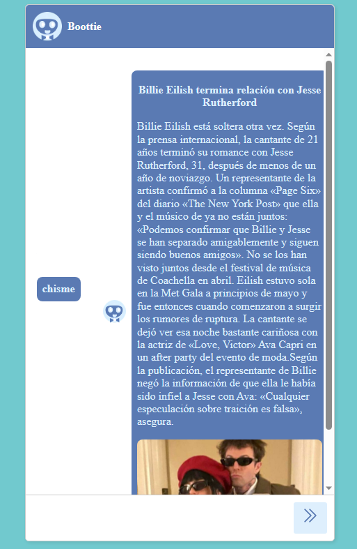
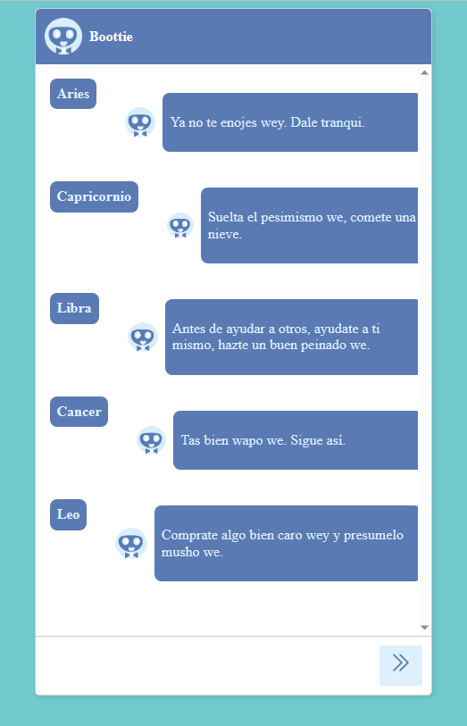

# Bottie

Este texto es una breve introducción a un programa que he creado usando JavaScript. El objetivo de este programa es poner en práctica lo que he aprendido sobre este lenguaje de programación y desafiar mis habilidades. Se trata de un pequeño bot que puede hacer algunas tareas básicas.
  
Si quieren probar boottie les dejo en enlace  
https://boottie.netlify.app/

# Secciones de bootie

1.- Bottie es una seccion divertida que te cuenta chistes. Solo tienes que escribirle "Chistes" y te mostrará uno al azar de su colección. Puedes pedirle más chistes si te gustan.

2.- ¿Te gustan los chismes?  

Entonces te encantará Bottie, el bot que sabe todo lo que pasa en el mundo. Bottie tiene una sección especial donde puedes pedirle que te cuente los chismes más jugosos que tiene guardados en su memoria. Solo tienes que escribirle "chisme" y él te sorprenderá con una historia increíble. ¡No te lo pierdas!
 

3.-¿Te gustan los horóscopos?     Entonces te encantará nuestra nueva sección. Solo tienes que ingresar tu signo zodiacal y te daremos un mensaje personalizado sobre tu personalidad, tu futuro y tu compatibilidad amorosa. ¡No te lo pierdas!
 
